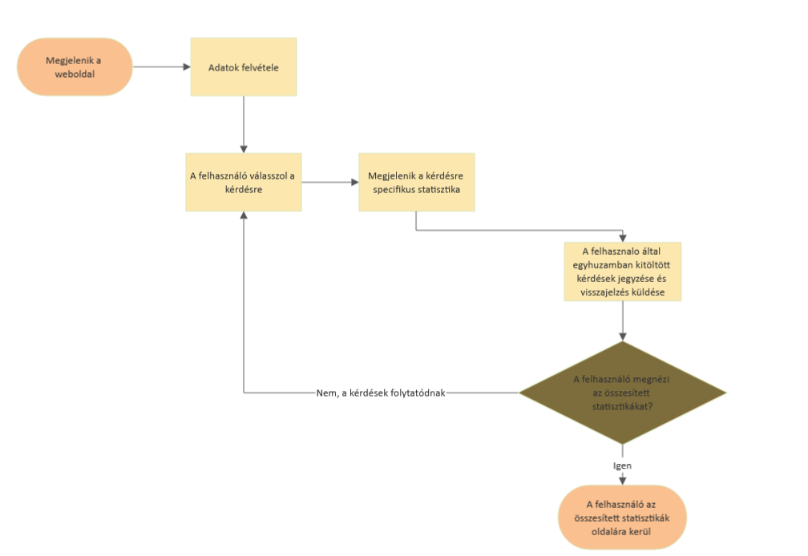

# Funkcionális specifikáció

### A rendszer célja

Adatok gyűjtése minél több ember közreműködésével, majd a kitöltési statisztikák alapján segíeni a különböző kézzel írt számok értékének megértését.

### Jelenlegi helyzet leírása

A kézírás értelmezése betűknél és számoknál egyaránt kihívást tud okozni az embereknek.
A különféle dokumentumokat, leveleket manapság már ritkán szokták kézzel írni, viszont amennyiben
egy dokumentum kitöltése, datálása kézírással történik, az így leírt dolgok tartalmazhatnak olyan részeket is,
(például dátum vagy személyes okmányok azonosítói) melyeket kézírással lehet csak feltüntetni. 
Az ily módon írt információk feldolgozása során olyan, írásképből adódó félreértések keletkezhetnek, melyek tisztázása nehézkes. 
Ilyen esetekben nincsen olyan eszköz, ami segítené az olvasót, valamint az a szerző kézírásához való hozzáférés nélkül lehet, 
nem képes az írás helyes értelmezésére. Ennek következménye lehet, hogy a dokumentum érvénytelen, 
ezáltal újraírást igényel, ami értékes időbe telik.

Szeretnénk egy olyan eszközt/statisztikát nyújtani munkatársainknak és az általunk támogatott intézményeknek, 
amely segítségével a különböző módon írt számok tényleges értékének értelmezését tudják gyakorolni, 
továbbá önkéntes alapon felmérhetjük az értelmezési tendenciákat.

### Vágyálomrendszer leírása

A projekt egyik célja egy olyan adatbázis kialakítása, melyből statisztikai kimutatásokat lehet készíteni a felhasználói válaszok alapján. 
A másik cél egy alkalmazás fejlesztése, mellyel gyakorolni tudják munkatársaink az írott számok felismerését.
A tesztben megjelenő képek legyenek súlyozottan randomizálva, hogy a nehézség fokozatosan növekedjen. 
A webes felület megjelenése legyen kompatibilis mobiltelefon, akár tablet képméreteivel, tehát rendelkezzen reszponzív felülettel. 
A tanulói és teszt képek ne foglaljanak túl sok tárhelyet. A weboldal kezelhetősége, megjelenése legyen egyszerű és lényegretörő, 
a széleskörű használhatóség érdekében. A teszt folyamatot bármikor meg lehessen szakítani, és újra lehessen folytatni. 
A teszt képek egymás után jövetele legyen gyors.

### Jelenlegi üzleti folyamatok

A mostani rendszerünk leginkább különböző típusú dokumentumokhoz biztosít CRUD műveleteket, amik a következőek:
- Létrehozás: bármilyen típusú dokumentum létrehozása 
> ennek egy átmeneti másolata képződik le az általunk használt felhő tárhelyen és az első mentés alkalmával a felhasználó dönt, hogy hol tárolódjon a file
- Visszaolvasás/Letöltés: 
    - akár online tárhelyen vagy gépről való visszaolvasás/megnyitás 
    - felhőből letöltés lehetősége
- Módosítás: bármilyen módon megnyitott dokumentumok módosítása és azok mentése 
> a módosítások egyből a felhőben vagy lokálisan tárolt dokumentumba mentődnek
- Törlés: felhőben tárolt dokumentumok kitörlése
> ez a folyamat visszafordíthatatlan, a felhasználónak többször is meg kell erősítenie  

Támogatja az üzleti életben legtöbbet használt formátumokat. (PDF, DOC/DOCX, XLS, XML, HTML)  
Mindehez 10 GB ingyenes tárhelyet biztosítunk a felhő szolgáltatással, ezen felül külön számlázással tarthat igényt a felhasználó tárhelyre, ami havi fizetéses.  
Amennyiben a felhasználó nem törölni szeretné a dokumentumot, akkor a szerkesztés folyamata a következő képpen néz ki:

### Igényelt üzleti folyamatok

- A webalkalmazás oldalra navigálás -> egyértelműen látszódik az tesztelés elkezdésének és az összetett statisztikák mutatásának lehetőségei, melyek HTML gombokként jelennek meg -> valamelyik gombra kattintás :
    - **Start** gombra kattintás:  
     a felhasználó megadja alapvető adatait, ezek még csak kliens oldalon kerülnek mentésre ->  
     elkezdődik a tesztelés ciklusa ->  
     a rendszer betölt egy képet az MNIST adatbázisból [ilyenkor érdemes lenne betölteni egy vagy két rákövetkező képet is, ezeket cache-be betölteni így meggyorsítva a képek betöltését] ->  
     megjelennek a lehetséges válaszok egy grind panelben, 1-9ig számokkal ->  
     a felhasználó választ egyet a lehetőségek közül ->  
     az eredmény bekerül az eredmények adattáblába, melynél fontos a visszaérkező kód ->  
     visszaérkezik arra a képre releváns statisztika, aminél még kliens oldali számítás nem szükséges ->  
     felhasználó egyhuzamban kitöltött tesztjeinek számát jegyezzük és visszajelzést biztosítunk ->  
     újra választhat a felhasználó, hogy folytatja a tesztek kitöltését vagy az összesített statisztikákat szeretné megtekinteni
    - **Összetett statisztika** gombra kattintás:  
     a felhasználó átkerül egy összesített statisztikákat mutató oldalra, ezeket nodejs bővítménnyel számíthatjuk ki ->  
     a felhasználó adatait, többek között a streak értékét, lementjük ->  
     visszanavigálhat a tesztelések oldalára, ahol nem kell újra kitölteni az adatait, esetleg úja le kell igazolnia azokat

### Igényelt üzleti folyamatok modellje

### Használati esetek

 - Új felhasználó:  
> Kötelező megadnia a szükséges adatait.  
> Beviteli mezőket kitöltve a megadott adatok kliens oldalon tárolódnak el.  
> Ez különböző technológiákkal is megoldható, szóba jöhetnek a cookie-k vagy javascripten keresztüli átvitel  
> Miután megadta az adatokat elkezdődik a tesztelési ciklus  

 - Visszatérő felhasználó:  
> Az adatai automatikusan kitöltődnek a beviteli mezőkben  
> Azonban szükséges egy megerősítés  
> Ezzel egy számítógépen több felhasználós kitöltés is megvalósítható  

 - Statisztikák kimutatása tesztelés közben:  
> A felhasználónak válaszadás után megjelenik egy egyszerű grafikon  
> Ebből könnyen leolvashatja, hogy milyen eredmények születtek eddig az adott tesztre  
> Ezáltal visszajelzést kap a saját teljesítményéről 

### A rendszerre vonatkozó szabályok

- A weboldalt HTML nyelven írjuk meg.
- A weboldal kliens-oldali funkcionalitásához JavaScriptet használunk.
- A weboldal megjelenését CSS stíluslappal formázzuk.
- Adatok hosszútávú tárolására egy SQL szervert veszünk igénybe.
- A weboldal CSS és JavaScript részeit külön álloményban adjuk meg, nem  a HTML-be ágyazva.
- A weboldalnak személyi számítógépről és okostelefonról is használhatónak kell lennie.
- A weboldalnak tudnia kell igazodni a megjelenítő eszköz felbontásához.

### Követelménylista

- K01 Hordozhatóság
- K02 Reszponzív dizájn
- K03 Rendszerfüggetlenség
- K04 Gyors működés
- K05 Könnyű kezelhetőség
- K06 A weboldal telefonon is megjeleníthető legyen
- K07 Gamifikáció/Játékosítás

### Fogalomszótár

- HTML - Hypertext Markup Language
- CSS - Cascading Style Sheets
- SQL - Structured Query Language
- CRUD - Négy alapvető művelet adatok tartós tárolásakor
    - Create: Létrehozás - HTTP POST kérés
    - Read: Visszaolvasás - HTTP GET kérés
    - Update: Frissítés/Módosítás - HTTP PUT kérés
    - Delete: Törlés - HTTP DELETE kérés
