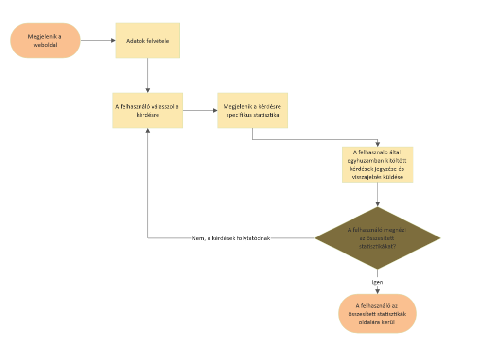
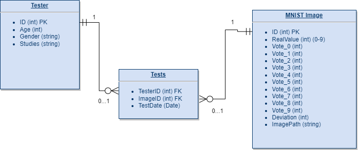

# Rendszerterv

## **A rendszer célja**

- Adatok gyűjtése minél több ember közreműködésével, majd a kitöltési statisztikák alapján segíeni a különböző kézzel írt számok értékének megértését.
- A felület fontos hogy elérhető legyen telefonon és weben is. Webes felület legyen kombatibilis az összes lehetséges eszköz képméretével.
- A kitöltési statisztikák különböző szempontok alapján

## **Projekt terv**

A projekt felülete HTML, CSS és JavaScript-ben fog készülni.  
Megvalósításban törekszünk arra, hogy számítógépes és mobilos felületen is élvezhető és esztétikus megjelenést biztosítsunk. A reszponzív felület élérését több eszközön való teszteléssel is biztosítjuk.

A grafikus megjelenítő felülethez egy szerver oldali alkalmazás fog társulni, ami összeköttetést biztosít az adatbázissal. Ez a backend alkalmazás fogja elvégezni a grafikonok számítását és megjelenítését valamint a szükséges adatokat biztosítja a MNIST tesztekhez.
A grafikonok és az adatok megfelelő működésének és megjelenítésének tesztelését több felületen is biztosítjuk.

## **Mérföldkövek**

- [M-00] Dokumentációk megírása.
- [M-01] Kezdetleges grafikus felület, az adatok bekérésének megvalósítása, adatbázis létrehozása és egy alap web szolgáltatás létrehozása.
- [M-02] MNIST tesztek elvégzésére szükséges rendszerek kialakítása (prototípus).
- [M-03] Alapvető grafikonok tervezése és előkészítése.
- [M-04] Összesített statisztikák oldalának szerkeztése, megvalósítsa.
- [M-05] Tesztelés és utolsó bugok kijavítása

## **Ütemterv**

1. [M-00] Közös meetingek alkalmával megírt, megbeszélt specifikációk.
2. [M-01] Megbeszélésen a grafikus felület feladatainak szétosztása, egy becsült idő megállapítása, alap frontend és backend megvalósítása.
3. [M-02] MNIST tesztek elvégzésére alkalmas prototípus megírása. (Még bugokat és hibákat tartalmazhat)
4. [M-03] A grafikonok megvalósításához szükséges technológiák megismerése. Kezdetleges váz összerakása.
5. [M-04] Kezdetleges váz kibővítése egy összesített statisztikákat mutató oldalra.
6. [M-05] Tesztelés és végleges verzió elkészítése.

## **Üzleti folyamatok**

- A webalkalmazás oldalra navigálás -> egyértelműen látszódik az tesztelés elkezdésének és az összetett statisztikák mutatásának lehetőségei, melyek HTML gombokként jelennek meg -> valamelyik gombra kattintás :
    - **Start** gombra kattintás:  
     a felhasználó megadja alapvető adatait, ezek még csak kliens oldalon kerülnek mentésre ->  
     elkezdődik a tesztelés ciklusa ->  
     a rendszer betölt egy képet az MNIST adatbázisból [ilyenkor érdemes lenne betölteni egy vagy két rákövetkező képet is, ezeket cache-be betölteni így meggyorsítva a képek betöltését] ->  
     megjelennek a lehetséges válaszok egy grind panelben, 1-9ig számokkal ->  
     a felhasználó választ egyet a lehetőségek közül ->  
     az eredmény bekerül az eredmények adattáblába, melynél fontos a visszaérkező kód ->  
     visszaérkezik arra a képre releváns statisztika, aminél még kliens oldali számítás nem szükséges ->  
     felhasználó egyhuzamban kitöltött tesztjeinek számát jegyezzük és visszajelzést biztosítunk ->  
     újra választhat a felhasználó, hogy folytatja a tesztek kitöltését vagy az összesített statisztikákat szeretné megtekinteni
    - **Összetett statisztika** gombra kattintás:  
     a felhasználó átkerül egy összesített statisztikákat mutató oldalra, ezeket nodejs bővítménnyel számíthatjuk ki ->  
     a felhasználó adatait, többek között a streak értékét, lementjük ->  
     visszanavigálhat a tesztelések oldalára, ahol nem kell újra kitölteni az adatait, esetleg úja le kell igazolnia azokat

Az adatbázisban tárolt számok között vannak olyanok, amelyek egyszerűbben felismerhetőek, de előfordulnak
más számokkal könnyen összetéveszthető kézírások is. Szeretnénk ha felhasználónként a kitöltések számával egyenesen arányosan jelenne meg egyre több ilyen megosztó kép, mivel ezekből érdekesebb statisztikákat lehet kinyerni.

**Megvalósítás:**

- Véletlen képválasztás manipulációja: minél több kérdésre válaszol a kitöltő, annál nagyobb eséllyel jelenik meg egy olyan kép, aminél a válasz nem egyértelmű, mindez az előző kitöltések alapján derül ki.
Minden kép esetén tárolásra kerülnek a hozzá tartozó válaszok. Ha ezekből a tárolt adatokból kimutatható hogy a válaszolók véleménye megegyező, akkor az adott kép kisebb gyakorisággal fog felbukkanni a továbbiakban, míg a kétértelműek többször, ezzel érdekesebbé téve a felmérést.

- Példa: a felhasználó elkezdi a teszt kitöltését
    - az első képnél ~99% az egyértelmű kép esélye
    - az ötödik képnél ~50% az egyértelmű kép esélye
    - a tizedik képnél ~25% az egyértelmű kép esélye

Amennyiben egy felhasználó az egyértelmű képekre nem a várt eredményt produkálja, az hatással lesz a kép egyértelműségi tényezőjére, így az más felhasználóknál frekventáltabban fog megjelenni.

### **Üzleti folyamatok modellje**



## **Funkcionális terv**

- A fejlesztés html, css és javascript nyelven történik.

- A felhasználó adatai:
    - Kor: A felhasználó korát egy html input kéri be
    - Nem: A felhasználó nemének meghatározása egy radio típusú html form használatának segítségével valósul meg
    - Legmagasabb iskolai végzettség bekérése egy lenyíló listával valósul meg

- Statisztikák:
    - Nem alapján.
    - Korcsoportok alapján.
    - Képre specifikus statisztika
    - Képek többértelműsége alapján
    - Egyhuzamban kitöltöttek alapján

## **Követelmények**

- [K01] Hordozhatóság
- [K02] Reszponzív dizájn
- [K03] Rendszerfüggetlenség
- [K04] Gyors működés
- [K05] Könnyű kezelhetőség
- [K06] A weboldal telefonon is megjeleníthető legyen
- [K07] Gamifikáció/Játékosítás

## **Fizikai környezet**

Az alkalmazás futtatására valamilyen böngészőre van szükség pl:
- Google Chrome
- Mozilla Firefox
- Microsoft Edge

Webre való fejlesztés miatt frontend és backend részekre osztjuk a fejlesztési környezteket.

##### Frontend:
- Visual Studio Code
- Windows Notepad
- Notepad++

##### Backend:
- Node.js
- Visual Studio Code
- MySQL

## **Domain specifikáció**

Az alkalmazás három fő részből áll össze:
1. Frontend fejlesztése:
	- Alapvető dizájn elemek megtervezése
	- Felhasználói adatok biztonságos továbbításának/megjelenítésének tervezése
	- Kliensoldali funkciók fejlesztése

2. Backend fejlesztése:
	- Beérkező adatok feldolgozását megvalósító funkciók fejlesztése üzleti logika alapján
	- Adatbázis és Backend kapcsolatának megtervezése
	- Különböző HTTP kérések kezelésének kigondolása

3. Adatbázis tervezés:
	- Adattábla értékek megtervezése
	- Adatok biztonságos tárolásának, kezelésének tervezése
    
## **Fogalmak**

- **Frontend:** A weboldal interaktív, a felhasználó által hozzáférhető része az alkalmazásnak, csak korlátozott adatot tekinthet meg.

- **Backend:** Az alkalmazás azon része, amely a Frontend-ről érkező adatok feldolgozásáért felelős, az adatbázis felé továbbítja ezeket. 

- **Adatbázis:** Az adatok perzisztens tárolására szolgál, ahonnan a Backend elérheti és felhasználhatja, valamint továbbíthatja a felhaszáló felé.
	
- **Perzisztens adattárolás:** Adatok hosszútávú tárolása.

## **Adatbázisterv**



### *Adatbázist legeneráló SQL script*

```sql
-- Tesztelők táblájának létrehozása
CREATE TABLE Tester(
    ID INT NOT NULL AUTO_INCREMENT,
    Age INT NOT NULL,
    Gender CHAR(1) NOT NULL COMMENT 'f-m-o',
    Studies VARCHAR(80) NOT NULL,
    PRIMARY KEY(`ID`)
);

-- MNIST képek táblájának létrehozása
CREATE TABLE MNIST_Image(
    ID BIGINT NOT NULL AUTO_INCREMENT,
    RealValue TINYINT NOT NULL,
    Vote_0 INT NOT NULL,
    Vote_1 INT NOT NULL,
    Vote_2 INT NOT NULL,
    Vote_3 INT NOT NULL,
    Vote_4 INT NOT NULL,
    Vote_5 INT NOT NULL,
    Vote_6 INT NOT NULL,
    Vote_7 INT NOT NULL,
    Vote_8 INT NOT NULL,
    Vote_9 INT NOT NULL,
    Deviation DECIMAL(16,13) NOT NULL,
    ImagePath VARCHAR(256) NOT NULL,
    PRIMARY KEY(`ID`)
);

-- Asszociációs tábla létrehozása
CREATE TABLE Tests(
    TesterID INT NOT NULL REFERENCES Tester(ID),
    ImageID BIGINT NOT NULL REFERENCES MNIST_Image(ID),
    TestDate DATE NOT NULL,
    PRIMARY KEY(TesterID, ImageID)
);
```

## **Tesztterv**
A tesztelésre folyamatosan sor kerül a fejlesztés alatt, valamint annak befejeztével is.
- Egységtesztek írása függvényekhez
- Kész alkalmazás tesztelése böngészőben
- Majdnem kész rendszer teszteltetése Alfa tesztelőkkel

A tesztelés célja, hogy a megtervezett funkciók rendeltetésszerűen működjenek. A tesztet tesztelő teszteli a tesztelő tesztkörnyezetben, 
hogy a tesztesetek kiteszetelve teszten kitesznek-e egy teljes tesztet.

#### Főbb tesztrészek:
- **Egységteszt**: A forráskód egységeit a kapcsolódó vezérlő adatokkal, a felhasználási-és a működtető eljárásokkal 
együtt tesztelik annak meghatározására, hogy azok elérik-e kitűzött céljukat. 
Automatizáltak, előre megadott tesztadatokkal, minél nagyobb dimenziókban fedjék le a lehetséges eseteket.

- **Tesztadat**: Bizonyos adatok megerősítő módon használhatók fel egy adott funkcióhoz adott bemeneti adat készlet az elvárt eredményt adja-e.
Más adatok felhasználhatók arra, hogy kivizsgálják a program azon képességét, hogy hogyan reagál a szokatlan, rendkívüli, kivételes vagy váratlan adatbevitelre.

- **Funkcionális teszt**: A szoftver rendszert a funkcionális követelmények / specifikációk alapján ellenőrzi.
A funkcionális tesztek célja a szoftveralkalmazás minden funkciójának tesztelése megfelelő bemenet biztosításával,
a kimenetnek a funkcionális követelményekkel való összehasonlításával.

- **Alfa teszt**: Az alfa tesztelést egy kis szakértői csoport végzi, aki tudja, hogyan találhat szoftverhibákat.
Bár a csapat csak néhány tagból áll, szakértelmük lehetővé teszi számukra, hogy elkapják a problémák többségét úgy, hogy a szoftvert minden olyan forgatókönyv segítségével be lehet állítani, és megpróbálhatják a bemenetek bármilyen kombinációját, hogy a szoftvert hibaivá tegyék.
Esetünkben is szakértők, egy közös discord channel tagjai próbálják meg minél kreatívabban észlelni a rendszer esetleges hiányait vagy
nagyobb hibáit.